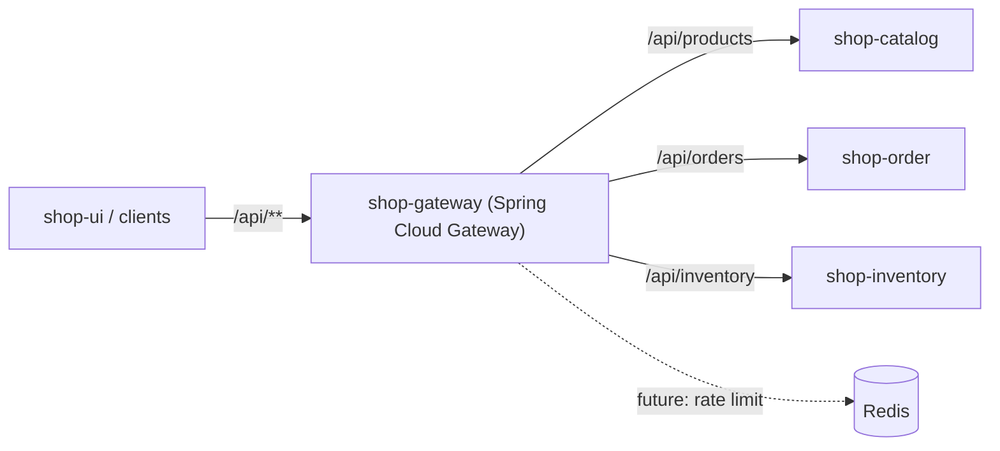
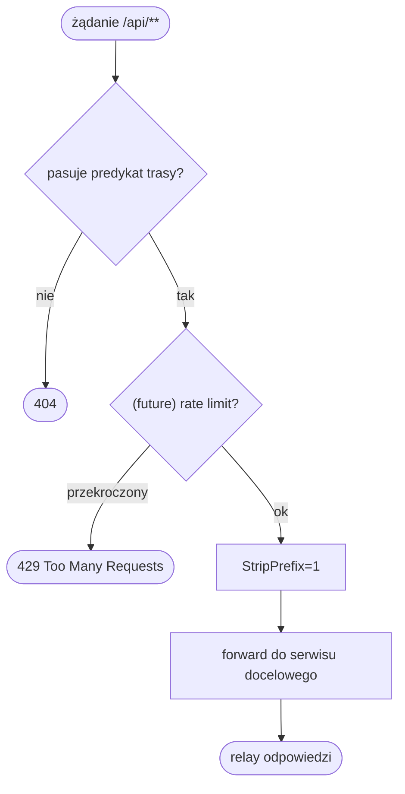

# shop-gateway

API Gateway (Spring Cloud Gateway, reaktywny, na Netty). Jedyny publiczny punkt
wejścia do backendu i pierwsza linia obrony przed przeciążeniem. Standalone repo
z własnym `Dockerfile` (multi-stage: build → JRE) i kodem.

## Routing
Trasy do serwisów po wewnętrznych adresach sieci `backend` (z env):

| Ścieżka            | Cel                                  |
|--------------------|--------------------------------------|
| `/api/products/**` | `CATALOG_SERVICE_URI` → shop-catalog |
| `/api/orders/**`   | `ORDER_SERVICE_URI` → shop-order     |
| `/api/inventory/**`| `INVENTORY_SERVICE_URI` → shop-inventory |

## Rate limiting (krytyczne przy flash sale)
`RequestRateLimiter` oparty o Redis (token bucket): `replenishRate`,
`burstCapacity`. `KeyResolver` ustala klucz limitu (po IP lub `userId` z tokenu).
Cel: odciąć boty i wielokrotne kliknięcia, zanim ruch dotrze do serwisów. Po
przekroczeniu → `429 Too Many Requests`.

## Uwierzytelnianie
Walidacja JWT (Spring Security Resource Server, `JWT_ISSUER_URI`). Odrzuca
nieuwierzytelnione żądania do chronionych ścieżek, przekazuje tożsamość dalej
(np. `X-User-Id`). Przeglądanie katalogu może być publiczne.

## Odporność
Circuit breaker (Resilience4j) i timeouty na trasach do serwisów; retry tylko dla
idempotentnych GET; CORS dla origin shop-ui (http://localhost:3000).

## Obserwowalność / health
Actuator (`/actuator/health`, `/actuator/prometheus`). Dockerfile runtime musi
zawierać `curl` (lub `wget`) dla healthchecku.

## Skalowanie
Bezstanowy → wiele instancji. Liczniki rate limitingu są w Redis, więc limit
działa spójnie niezależnie od liczby instancji Gateway.

## High Level Design (ogólny workflow)

Reaktywny punkt wejścia (Netty). Dopasowuje trasę po predykacie ścieżki, zdejmuje
prefiks `/api` (`StripPrefix=1`) i przekazuje do serwisu po DNS sieci `backend`.
Rate limiting (Redis) i JWT to warstwy docelowe.

## Low Level Design (diagram aktywności)

